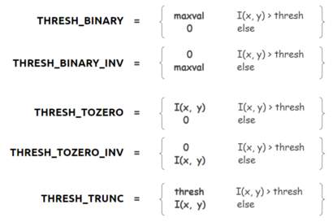
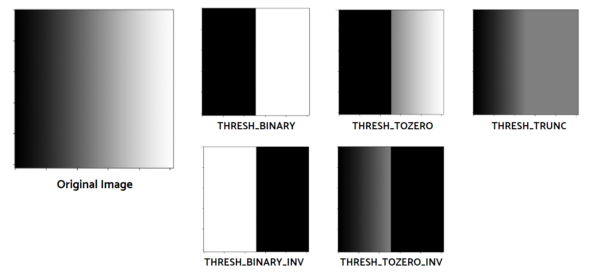
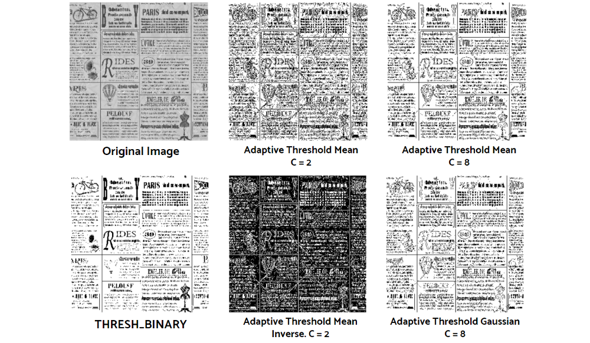

# Thresholding

Thresholding transforms images into binary images. We need to set the threshold value and max values and then we convert the pixel values accordingly.

The main thresholding methods are:

- Binary
- Binary Inverse
- Threshold to Zero
- Threshold to Zero Inverse
- Threshold Truncation
- Adaptive Thresholding

```python
thresh = 127
maxval = 255
_, thresh_bin = cv2.threshold(img, thresh, maxval, cv2.THRESH_BINARY)
_, thresh_bin_inv = cv2.threshold(img, thresh, maxval, cv2.THRESH_BINARY_INV)
_, thresh_0 = cv2.threshold(img, thresh, maxval, cv2.THRESH_TOZERO)
_, thresh_0_inv = cv2.threshold(img, thresh, maxval, cv2.THRESH_TTOZERO_INV)
_, thresh_trunc = cv2.threshold(img, thresh, maxval, cv2.THRESH_TRUNC)
```





## Adaptive Thresholding

This is a method of applying different thresholds on different areas of the image as to get a better output as illuminations of pixel vary.

We need to convert the color mode to grayscale to apply adaptive thresholding.

The parameters of adaptive thresholding are `maxValue`, `adaptiveMethod` , `thresholdType` , `blockSize` and `C` . The adaptive method here has two kinds: 

- `ADAPTIVE_THRESH_MEAN_C` , 
- `ADAPTIVE_THRESH_GAUSSIAN_C`

```python
img = cv2.cvtColor(img, cv2.COLOR_BGR2RAY)
_, thresh_bin = cv2.threshold(img, thresh=127, maxval=255, type=cv2.THRESH_BINARY)
adap_mean_2 = v2.adaptiveThreshold(img, maxval, 
                                    cv2.ADAPTIVE_THRESH_MEAN_C, 
                                    cv2.THRESH_BINARY, 7, 2)
adap_mean_2_inv = v2.adaptiveThreshold(img, maxval, 
                                    cv2.ADAPTIVE_THRESH_MEAN_C, 
                                    cv2.THRESH_BINARY_INV, 7, 2)
adap_mean_8 = v2.adaptiveThreshold(img, maxval, 
                                    cv2.ADAPTIVE_THRESH_MEAN_C, 
                                    cv2.THRESH_BINARY, 7, 8)
adap_gaussian_8 = v2.adaptiveThreshold(img, maxval, 
                                    cv2.ADAPTIVE_THRESH_GAUSSIAN_C, 
                                    cv2.THRESH_BINARY, 7, 8)
```




# Reference

[1] : https://towardsdatascience.com/computer-vision-for-beginners-part-2-29b3f9151874
