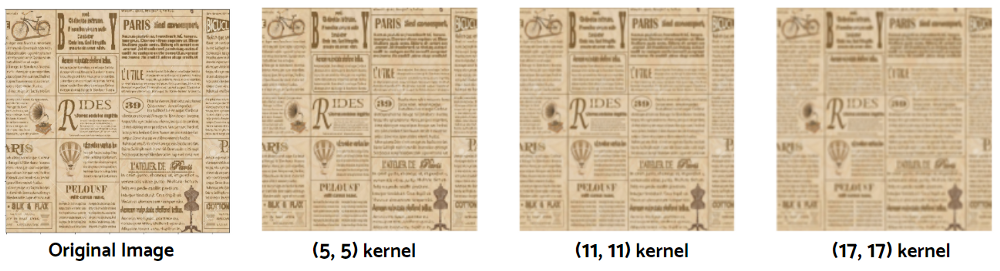
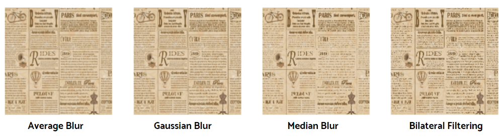

# Blurring

The goal of blurring is to perform noise reduction. But we have to pay extra care here. If we apply edge detection algorithms to the images with high resolution, we’ll get too many detected outcomes that we aren’t interested in.

On the contrary, if we blur the images too much, we‘ll lose the data. Therefore we need to find an adequate amount of blurring we’re going to apply without losing desirable edges.

There are multiple techniques used for bluring:

- Averaging
- Gaussian
- Median
- Bilateral

There are more but these the most widely used.

## Average Blurring

**Average blurring** is taking the average of all the pixel values under the given kernel area and replace the value at the center.

Then what will it be like if we increase the size of the kernel? As the size of filters gets bigger, the pixel values will be normalized more. Therefore we can expect the image to get blurred the more.

Basic operation on an Image A looks like this:

$$
AvgBlr = \frac{1}{n\times n}
\begin{bmatrix}
1 & 1 & ... & 1 \\
1 & 1 & ... & 1 \\
: & : & ::: & : \\
1 & 1 & ... & 1
\end{bmatrix} * A
$$

OpenCV implementation:

```python
img_blurred = cv.blur(img, ksize=(s,s))
```

## Median Blurring

**Medium blurring** is the same with average blurring except that it uses the median value instead of the average. Therefore when we have to handle sudden noises in the image such as ‘[salt and pepper noise](https://en.wikipedia.org/wiki/Salt-and-pepper_noise),’ it’ll be better to use medium blurring than average blurring.

```python
kernel_size = 5
img_blurred = cv2.medianBlur(img, kernel_size)
```



## Gaussian Blurring

**Gaussian blurring** is nothing but using the kernel whose values have a Gaussian distribution. The values are generated by a Gaussian function so it requires a sigma value for its parameter.

In the kernel for gaussian blur, the values of the kernel go higher near the center and go smaller near the corner.

 It’s good to apply this method to the [noises that have a normal distribution](https://en.wikipedia.org/wiki/Gaussian_noise) such as [white noise](https://en.wikipedia.org/wiki/White_noise).

```python
img_blurred = cv2.GaussianBlur(img, ksize=(5,5), sigmaX = 0)
```

## Bilateral Filtering

It is an advanced version of Gaussian blurring. Blurring produces not only dissolving noises but also smoothing edges.

**Bilateral filter can keep edges sharp while removing noises**. It uses Gaussian-distributed values but takes both distance and the pixel value differences into account.

It requires `sigmaSpace` and `sigmaColor` for the parameters.

```python
kernel_size = 5
img_blurred = cv2.bilateralFilter(img, kernel_size, sigmaSpace=75, sigmaColor=75)
```




# Reference

[1]: https://towardsdatascience.com/computer-vision-for-beginners-part-2-29b3f9151874
