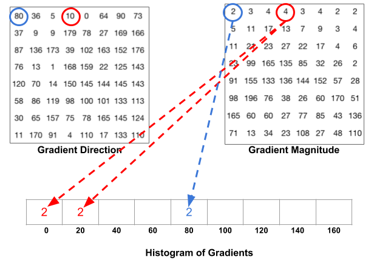
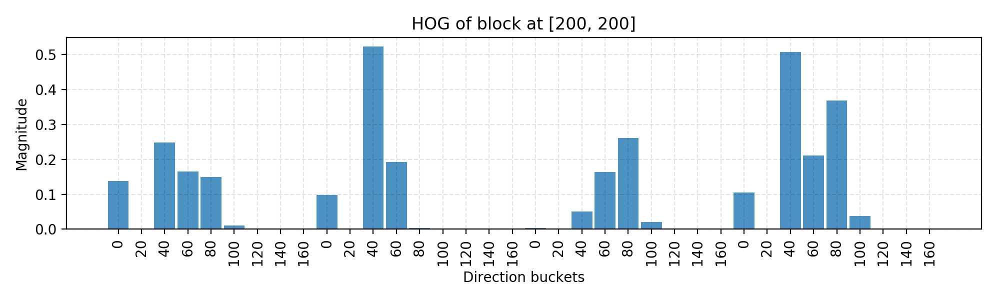
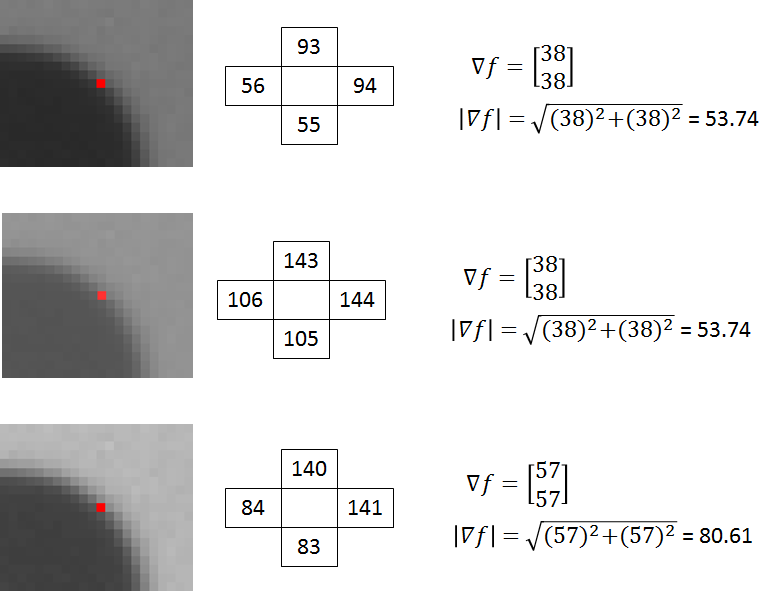

# Histogram of Oriented Gradients or HOG

The Histogram of Oriented Gradients (HOG) is an efficient way to extract features out of the pixel colors for building an object recognition classifier. 

***HOG is based on the idea that local object appearance can be effectively described by the distribution ( histogram ) of edge directions ( oriented gradients ).***

**This was introduced as a person detection algorithm**

It was introduced to work on a 64x128 pixel wide image.

## What HOG does

- Compute the gradient vector of each pixel i.e. the magnitude and the direction

- Divide the image into many 8x8 pixel cells. In each cell, the magnitude values of these 64 cells are binned and cumulatively added into 9 buckets of unsigned direction (no sign, so 0-180 degree rather than 0-360 degree; this is a practical choice based on empirical experiments).
  
  For example, if a pixel’s gradient vector has magnitude 8 and degree 15, it is between two buckets for degree 0 and 20 and we would assign 2 to bucket 0 and 6 to bucket 20.
  
  
  
  This interesting configuration makes the histogram much more stable when small distortion is applied to the image.

- Then we slide a 2x2 cells (thus 16x16 pixels) block across the image. In each block region, 4 histograms of 4 cells are concatenated into one-dimensional vector of 36 values and then **normalized** to have an unit weight.

- The final HOG feature vector is the concatenation of all the block vectors. It can be fed into a classifier like SVM for learning object recognition tasks.

The HOG for 1 block:

## Concise Info

- **Input Image: 64x128 pixels**

- Blocks = 8x8 pixels

- Gradient Calculation:
  
  - X-axis kernel: [-1 0 1]
  - Y-axis kernel: [-1 0 1]^T^
  - Gradient = $\sqrt{g_x^2 + g_y^2}$
  - $\theta = arctan(\frac{g_x}{g_y})$

- No of blocks  = (64x128)/(8x8) = 8x16 blocks

- Histogram Calculation = on all 8x8 pixels in 1 block each with stride = 1 block

- Histogram Normalization = for each cell on each block

- Block Normalization = on 2x2 Blocks with stride = 1 block

- **Final Output** = 7x15 blocks = 7x15 x 4 histogram vector = 7x15 x 4 x 9 values = **3780 values**

## Principle behind HOG

The principle behind the histogram of oriented gradients descriptor is that local object appearance and shape within an image can be described by the distribution of intensity gradients or edge directions.

The x and y derivatives of an image (Gradients) are useful because the magnitude of gradients is large around edges and corners due to abrupt change in intensity and we know that edges and corners pack in a lot more information about object shape than flat regions. So, the histograms of directions of gradients are used as features in this descriptor.

## Step Intuition

## Why “Split” the Gradient Vector?

For each gradient vector (i.e. is the difference along x and y direction), it’s contribution to the histogram is given by the magnitude of the vector (so stronger gradients have a bigger impact on the histogram). We split the contribution between the two closest bins. So, for example, if a gradient vector has an angle of 85 degrees, then we add 1/4th of its magnitude to the bin centered at 70 degrees, and 3/4ths of its magnitude to the bin centered at 90.

### Why distribute gradient in “bins”?

Why put the gradients into this histogram, rather than simply using the gradient values directly? The **gradient histogram is a form of “quantization”,** where in this case we are reducing 64 vectors with 2 components each down to a string of just 9 values (the magnitudes of each bin). Compressing the feature descriptor may be important for the performance of the classifier, but I believe the **main intent here is actually to generalize the contents of the 8x8 cell**.

Imagine if you deformed the contents of the 8x8 cell slightly. You might still have roughly the same vectors, but they might be in slightly different positions within the cell and with slightly different angles. The histogram bins allow for some play in the angles of the gradients, and certainly in their positions (the histogram doesn’t encode _where _each gradient is within the cell, it only encodes the “distribution” of gradients within the cell).

## Why Histogram Normalization?

1st image is the original image,

2nd is a brighter version (+50 in each cell) and 

3rd is a 1.5x times the pixel values of 1st image.

As we can see the absolute gradient is different for the images even if they are same.

But if we normalize it then the value turns out to be [0.71, 0.71] for all the 3 images.

Thus normalizing is necessary  for this approach to get the same result even if the original has been changes slightly.

## Why Block Normalization?

Block normalization is performed by concatenating the histograms of the four cells within the block into a vector with 36 components (4 histograms x 9 bins per histogram). Divide this vector by its magnitude to normalize it.

???????

# Reference

[1]: http://mccormickml.com/2013/05/09/hog-person-detector-tutorial/

[2]: https://lilianweng.github.io/lil-log/2017/12/15/object-recognition-for-dummies-part-2.html
