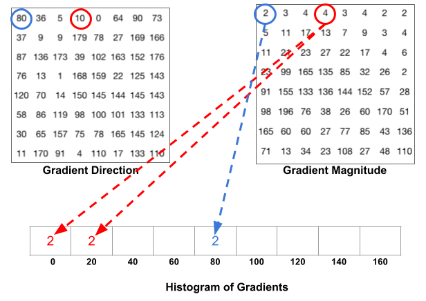

# Histogram of Oriented Gradients or HOG

The Histogram of Oriented Gradients (HOG) is an efficient way to extract features out of the pixel colors for building an object recognition classifier. 

## What HOG does

- Preprocess the image i.e. resizing and color normalization

- Compute the gradient vector of each pixel i.e. the magnitude and the direction

- Divide the image into many 8x8 pixel cells. In each cell, the magnitude values of these 64 cells are binned and cumulatively added into 9 buckets of unsigned direction (no sign, so 0-180 degree rather than 0-360 degree; this is a practical choice based on empirical experiments).

  For example, if a pixel’s gradient vector has magnitude 8 and degree 15, it is between two buckets for degree 0 and 20 and we would assign 2 to bucket 0 and 6 to bucket 20.

  

  This interesting configuration makes the histogram much more stable when small distortion is applied to the image.

- Then we slide a 2x2 cells (thus 16x16 pixels) block across the image. In each block region, 4 histograms of 4 cells are concatenated into one-dimensional vector of 36 values and then normalized to have an unit weight.

- The final HOG feature vector is the concatenation of all the block vectors. It can be fed into a classifier like SVM for learning object recognition tasks.

The HOG for 1 block:

## Principle behind HOG

The principle behind the histogram of oriented gradients descriptor is that local object appearance and shape within an image can be described by the distribution of intensity gradients or edge directions.

The x and y derivatives of an image (Gradients) are useful because the magnitude of gradients is large around edges and corners due to abrupt change in intensity and we know that edges and corners pack in a lot more information about object shape than flat regions. So, the histograms of directions of gradients are used as features in this descriptor.