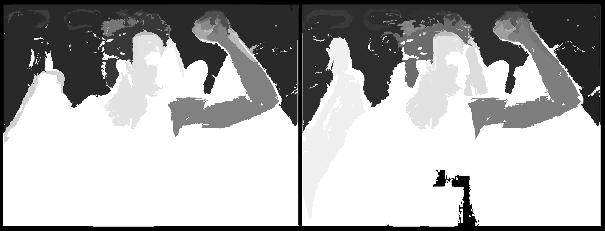

# Image Segmentation

When there exist multiple objects in one image (true for almost every real-world photos), we need to identify a region that potentially contains a target object so that the classification can be executed more efficiently.

Felzenszwalb and Huttenlocher ([2004](http://cvcl.mit.edu/SUNSeminar/Felzenszwalb_IJCV04.pdf)) proposed an algorithm for segmenting an image into similar regions using a graph-based approach. It is also the initialization method for Selective Search (a popular region proposal algorithm).

## Felzenswalb’s Algorithm

Say, we use a undirected graph G=(V,E) to represent an input image. One vertex vi∈V represents one pixel. One edge e=(v~i~,v~j~)∈E connects two vertices v~i~ and v~j~. Its associated weight w(v~i~,v~j~) measures the dissimilarity between v~i~ and v~j~. The dissimilarity can be quantified in dimensions like color, location, intensity, etc. The higher the weight, the less similar two pixels are. A segmentation solution S is a partition of V into multiple connected components, {C}. Intuitively similar pixels should belong to the same components while dissimilar ones are assigned to different components.

### Graph Construction

There are two approaches to constructing a graph out of an image.

- **Grid Graph**: Each pixel is only connected with surrounding neighbours (8 other cells in total). The edge weight is the absolute difference between the intensity values of the pixels.
- **Nearest Neighbor Graph**: Each pixel is a point in the feature space (x, y, r, g, b), in which (x, y) is the pixel location and (r, g, b) is the color values in RGB. The weight is the Euclidean distance between two pixels’ feature vectors.

### Concept of Component Difference

Using the defined concepts [here][1] of 

- Internal difference: $Int(C)$
- Difference between 2 components: $Dif(C_1,C_2)$
- Minimum internal difference: $M\ Int(C_1,C_2)$

The quality of a segmentation is assessed by a pair wise region comparison predicate defined for given 2 regions $C_1$ and $C_2$:

$$
D(C_1,C_2) = 
\begin{cases} 
True & if\ Dif(C_1,C_2) > M\ Int(C_1,C_2)\\
False & otherwise
\end{cases}
$$
When the predicate holds true, we consider them as 2 independent components otherwise the segmentation is too fine and they should be merged together.

## How Image Segmentation Works

The algorithm follows a bottom-up procedure. Given G=(V,E) and |V|=n,|E|=m:

1. Edges are sorted by weight in ascending order, labeled as e~1~,e~2~,…,e~m~.
2. Initially, each pixel stays in its own component, so we start with n components.
3. Repeat for k=1,…,m:
   - The segmentation snapshot at the step k is denoted as S^k^.
   - We take the k^th^ edge in the order, e~k~=(v~i~,v~j~).
   - If v~i~ and v~j~ belong to the same component, do nothing and thus S^k^=S^k−1^.
   - If v~i~ and v~j~ belong to two different components C~i~^k−1^ and C~j~^k−1^ as in the segmentation S^k−1^, we want to merge them into one if $w(v_i,v_j) ≤ M\ Int(C^{k−1}_i,C^{k−1}_j)$ otherwise do nothing.

If we put a limit on $k$ then we can tune the no of components in the image. Thus $k$ can be used as a parameter to handle the quality of the image segmentation.

Smaller the value of $k$, smaller will be the regions and thus more number of regions will be detected in an image.

Higher the value of $k$, higher will be the region size, and thus less number of regions will be detected in the image.

for the following image:

we will have the following segmentation when using k=50, k = 100 and k=1000

#  Reference

[1]: definitions.md