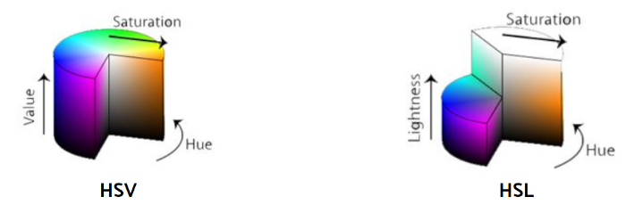

# Introduction to Computer Vision

## OpenCV

OpenCV stands for [***Open Source Computer Vision***](https://opencv.org/) library and it’s invented by Intel in 1999. It’s first written in C/C++ so you may see tutorials more in C languages than Python. But now it’s also getting commonly used in Python for computer vision as well.

The default setting of the color mode in OpenCV comes in the order of BGR, which is different from that of Matplotlib. Therefore to see the image in RGB mode, we need to convert it from BGR to RGB as follows.

```python
img_rgb = cv2.cvtColor(img_bgr, cv2.COLOR_BGR2RGB)
```

## Color Model

 [***A color model***](https://www.designersinsights.com/designer-resources/understanding-color-models/) is a system for creating a full range of colors using the primary colors. There are two different color models here: ***additive color models*** and ***subtractive color models***.

Additive models use light to represent colors in computer screens while subtractive models use inks to print those digital images on papers.

Additive model uses RGB(**R**ed **G**reen **B**lue) color scheme whereas Subtractive model uses CMYK(**C**yan **M**agenta **Y**ellow blac**K**) color scheme.

But in real worl we also have other kinds of model

- grayscale
- HSV(**H**ue **S**aturation **V**alue)
- HLS(**H**ue **L**ighntess **S**aturation)



HSV and HLS take a bit different aspect. As you can see above, they have a three-dimensional representation, and **it’s more similar to the way of human perception**. ***HSV*** stands for hue, saturation and value. ***HSL*** stands for hue, saturation and lightness.

The center axis for HSV is the value of colors while that for HSL is the amount of light. Along the angles from the center axis, there is hue, the actual colors. And the distance from the center axis belongs to saturation.

```python
# converting into hls and hsv
img_hsv = cv2.cvtColor(img, cv2.COLOR_BGR2HSV)
img_hls = cv2.cvtColor(img, cv2.COLOR_BGR2HLS)
```


## Drawing on Image

**Note: Remember to make a copy of the image before drawing as the actual image passed as parameter get edited in place of a new copy.**

### Rectangle

```python
cv2.rectangle(img_copy, pt1=(x1,y1), pt2=(x2,y2), color=(r,g,b), thickness=t)
```

### Circle

```python
cv2.circle(img_copy, cente=(x,y), radius=rd, color=(r,g,b), thickness=t)
```

### Text

```python
cv2.putText(img_copy, text=txt, org=(x,y)
            fontFace=cv2.FONT_HERSHEY_DUPLEX,
            fontScale=fs,
            color=(r,g,b),
            thickness=t,
            lineType=cv2.LINE_AA)
```


