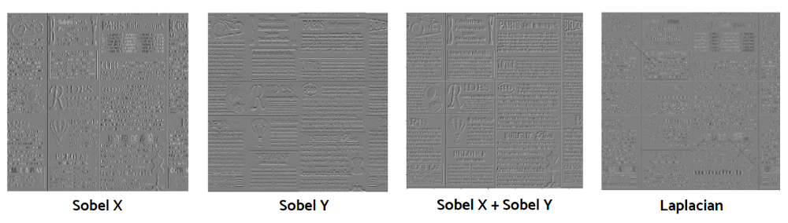

# Gradient

In mathematics, the [gradient](https://en.wikipedia.org/wiki/Gradient) geometrically represents the slope of the graph of a function with multi-variables. As it is a vector-valued function, it takes a direction and a magnitude as its components.

The [image gradient](https://en.wikipedia.org/wiki/Image_gradient) represents directional changes in the intensity or color mode and we can use this concept for locating edges.

## Sobel

[**Sobel operation**](https://en.wikipedia.org/wiki/Sobel_operator) uses both Gaussian smoothing and differentiation.

```python
sobel_X = cv2.Sobel(img, cv2.CV_64F, dx=1, dy=0, ksize=5)
sobel_y = cv2.Sobel(img, cv2.CV_64F, dx=0, dy=1, ksize=5)
blend = cv2.addWeighted(src1=sobel_x, alpha=0.5, src2=sobel_y, beta=0.5, gamma=0)
```

## Laplacian Operation

**Laplacian operation** uses the second derivatives of x and y. The mathematical expression is shown below.

$\Large L(X,y) = \frac{\partial^2I}{\partial x^2} + \frac{\partial^2I}{\partial y^2}$

```python
laplacian = cv2.Laplacian(img, cv2.CV_64F)
```




# Reference

[1]: [https://towardsdatascience.com/computer-vision-for-beginners-part-2-29b3f9151874]


