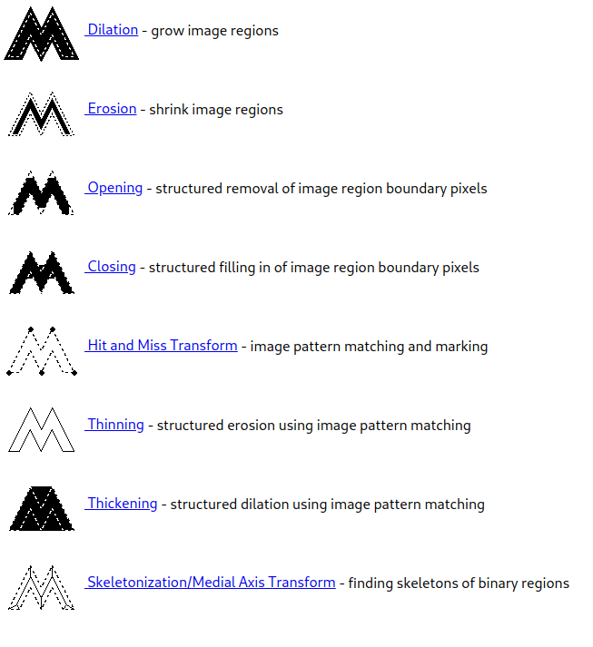
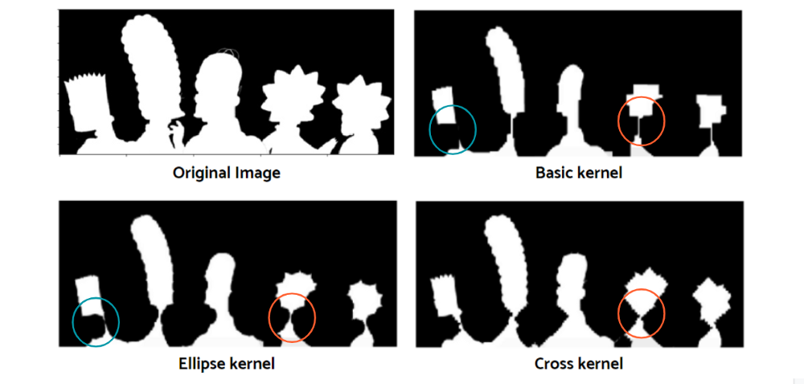
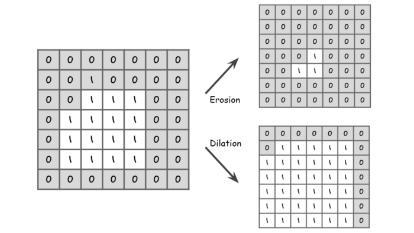
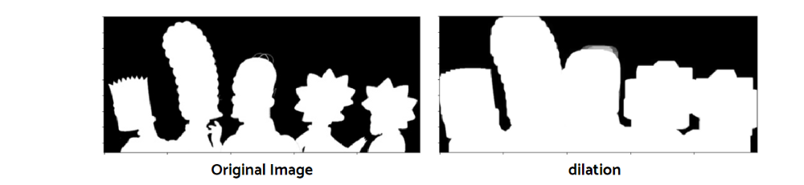
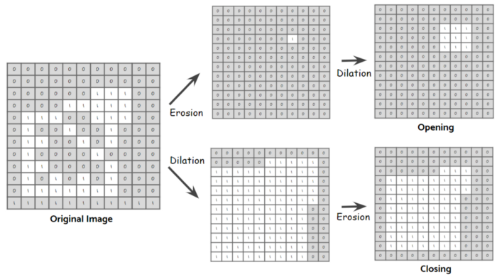
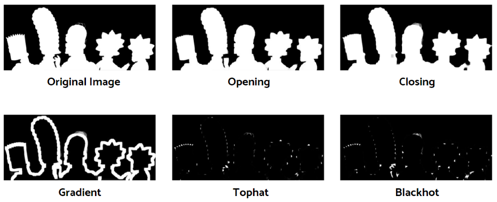

# Morphological Transformations

## ## TL;DR



## Erosion

**Erosion** is the technique for shrinking figures and it’s usually processed in a grayscale. The shape of filters can be a rectangle, an ellipse, and a cross shape. By applying a filter we remove any 0 values under the given area.

```python
kernel_0 = np.ones((9,9), np.unint8)
kernel_1 = cv2.getStructuringElement(cv2.MORPH_ELLIPSE, (9,9))
kernel_2 = cv2.getStructuringElement(cv2.MORPH_CROSS, (9,9))
kernels = [kernel_0, kernel_1, kernel_2]
for k in kernels:
    img_copy = cv2.erode(img, k, itterations=3)
```



## Dialation

**Dilation** is the opposite to erosion. It is making objects expand and the operation will be also opposite to that of erosion.



```python
kernel = np.ones((9,9), np.uint8)
img = cv2.dilate(img, kernel, itterations=3)
```



## Opening and Closing

**Opening** and **closing** operation is the mixed version of erosion and dilation. Opening performs erosion first and then dilation is performed on the result from the erosion while closing performs dilation first and the erosion.



Closing is useful to detect the overall contour of a figure and opening is suitable to detect subpatterns.

```python
kernel = np.ones((9,9), np.uint8)
img_open = cv2.morphologyEx(img, op=cv2.MORPH_OPEN, kernel)
img_close = cv2.morphologyEx(img, op=cv2.MORPH_CLOSE, kernel)
```

## Gradient, TopHat and BlackHat

Gradient filter (`MORPH_CGRADIENT`) is the subtracted area from dilation to erosion.

Top hat filter (`MORPH_TOPHAT`) is the subtracted area from opening to the original image while black hot filter (`MORPH_BLACKHAT`) is that from closing.

```python
kernel = np.ones((9,9), np.uint8)
img_grad = cv2.morphologyEx(img, op=cv2.MORPH_GRADIENT, kernel)
img_tophat = cv2.morphologyEx(img, op=cv2.MORPH_TOPHAT, kernel)
img_blackhat = cv2.morphologyEx(img, op=cv2.MORPH_BLACKHAT, kernel)
```




# Reference

[1]:[https://towardsdatascience.com/computer-vision-for-beginners-part-2-29b3f9151874]


